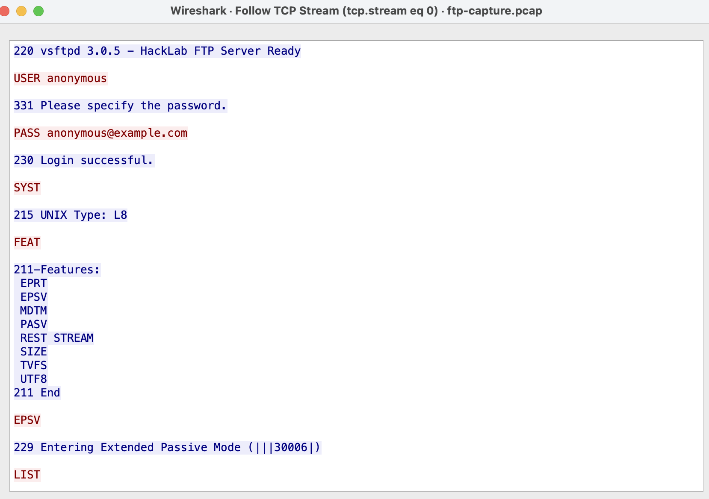

# 脆弱性診断報告書 — HackLab (target-ftp)

| 項目 | 内容 |
|------|------|
| 診断対象 | HackLab target-ftp (`172.20.0.20:21`) |
| 診断日 | 2026-08-11 |
| 診断者 | HackHero |
| 診断範囲 | ローカル Docker 環境内の `target-ftp` のみ |

> **注記**: この報告書は教育目的の自作やられアプリに対する自己診断記録である。
> 実在するシステムへの無断診断・攻撃は不正アクセス禁止法に抵触するため、
> 必ず自分が管理する環境でのみ行うこと。

書き方に迷ったら [vulnerability-report-template.md](vulnerability-report-template.md) の
「書き方ガイド」と「大事な筋道は4つだけ (どこに/なぜ/どうやると/どう直すか)」を参照。

---

## 1. エグゼクティブサマリー

本診断では HackLab target-ftp に対して手動診断を実施した。
匿名ログインが有効になっており、認証なしでファイル一覧の閲覧が可能なこと、
また通信が暗号化されておらず認証情報が平文で流れることを確認しました。
以上のことから２件の脆弱性を発見。

---

## 2. 深刻度一覧

| # | 脆弱性名 | 深刻度 | CVSS v3.1 目安 | 場所 |
|---|---------|--------|----------------|------|
| 1 | FTP 匿名ログイン + 認証情報の平文送信 | High | 7.5 (AV:N/AC:L/PR:N/UI:N/S:U/C:H/I:N/A:N) | `target-ftp` |

---

## 3. 詳細所見

### 3.1 FTP 匿名ログイン + 認証情報の平文送信

**深刻度**:  High

**該当箇所**: `hacklab/target-ftp/vsftpd.conf:4` (`anonymous_enable=YES`)

**概要**

1. FTP通信をpcapファイルにキャプチャし、WireSharkで解析したところ、通信が暗号化されておらず、
ユーザー名とパスワードが平文のまま送信されていることを確認した。この結果、盗聴が可能な状態であることが分かった。

2. ユーザー名がanonymousの場合、パスワードなしでログインできる設定になっており、認証設定の不備が確認できた。

以上の2件の脆弱性を発見した。

**影響**

認証情報が筒抜けの状態になっているため、攻撃者にアカウントを不正利用されたり、ftpを悪用してバックドアを設置されたりする恐れがある。


**再現手順**
1. `docker exec -it hacklab-web sh` でコンテナに入る
2. `ftp 172.20.0.20` で接続
3. ユーザー名 `anonymous`、パスワードは任意のメールアドレス風の文字列を入力
4. ログイン成功後 `ls` でディレクトリ一覧が見えることを確認

(Wireshark/tcpdump での盗聴を別途行った場合はその手順も追記する)

**証跡 (スクリーンショット)**

Wireshark の「Follow TCP Stream」で FTP セッションを確認した様子。
`USER anonymous` / `PASS anonymous@example.com` が平文で送信され、
`230 Login successful.` で認証なしログインが成立していることが分かる。



**修正提案**
```
# Before (vsftpd.conf)
anonymous_enable=YES

# After
anonymous_enable=NO
```

ftpを平文のままリモートログインすると、Wiresharkによって実際に盗聴できることが確認された。対策として、
anonymousによるパスワードなしログインを廃止し、正しいユーザー名とパスワードでの認証に切り替えること、
または、ftps等の暗号化通信に移行することを提案する。

---

## 4. まとめ・総評

ユーザー名がanonymousのままパスワード入力なしでログインでき、ファイルを閲覧できる状態になっていることに加え、
ftpの通信が暗号化されていないため、Wiresharkで機密情報(ユーザー名やパスワード)を盗聴できることが確認できた。
これらの原因は、認証設定と通信の暗号化についての検証・対策が行われていなかったことにあると考えられる。
脆弱性の深刻度はHighであるため、ftpについての対策を最優先に進めるべきである。対策後は再度ftpの脆弱性診断を行うことを推奨する。


---

*本報告書は教育目的で自作したローカル環境 (HackLab) に対する自己診断記録である。*
