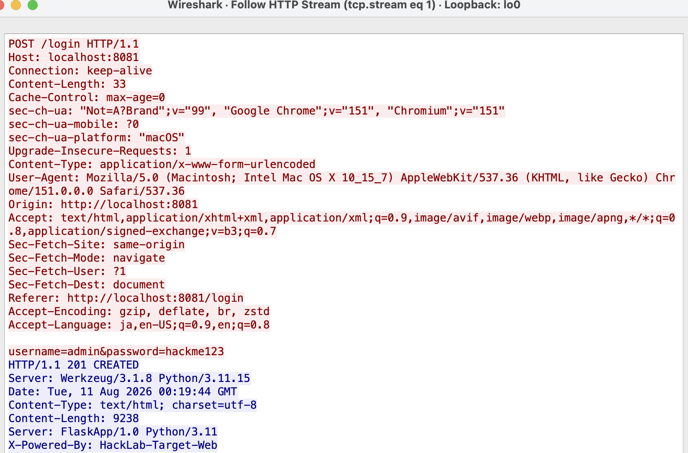

# 脆弱性診断報告書 — HackLab (target-web)

| 項目 | 内容 |
|------|------|
| 診断対象 | HackLab target-web (`http://localhost:8081`) |
| 診断日 | YYYY-MM-DD |
| 診断者 | (氏名) |
| 診断範囲 | ローカル Docker 環境内の `target-web` のみ |

> **注記**: この報告書は教育目的の自作やられアプリに対する自己診断記録である。
> 実在するシステムへの無断診断・攻撃は不正アクセス禁止法に抵触するため、
> 必ず自分が管理する環境でのみ行うこと。

---

## 書き方ガイド (迷ったらここを見る)

報告書は「知らない人が読んでも再現できる」ことが目的。難しく考えず、
**友達に説明するつもりで** 埋めていけばよい。各項目で書くことは以下の通り。

| 項目 | 何を書くか | 一言で言うと |
|------|-----------|-------------|
| 概要 | その脆弱性が「一言で言うと何なのか」 | 「入力をそのままSQLに入れているのでウソをつける」 |
| 影響 | 悪用されたら**具体的に何が奪われる/壊れるか** | 「パスワードなしでadminになれる」「全員分のパスワードが盗める」 |
| 再現手順 | **自分が実際にやった操作を順番通りに** そのまま書く | 「①ここを開く②これを入力する③これを押す」 |
| 証跡 | 再現手順の「4」をやった直後の画面のスクショ | 「実際にログインできてしまった画面」 |
| 修正提案 | どう直せば防げるか (Before/After) | 「f-stringをやめてプレースホルダにする」 |

**コツ**: まず「再現手順」だけ先に埋めるのがおすすめ。実際に手を動かした順番を
そのままメモすればいいので一番書きやすい。概要・影響はその後で
「なぜその手順で攻撃が成立したのか」を1〜2文にまとめれば書ける。

3.1 と 3.2 と 3.3 に**書き終えた完全な例**があるので、まずはそれを読んでから
自分の担当分 (3.4 以降) を書き始めるとイメージが掴みやすい。

### 大事な筋道は4つだけ

脆弱性診断報告書で押さえるべき筋道は、次の4点に集約される。

1. **どこに** — コードのどの箇所 (ファイル・行番号) が問題か
2. **なぜ危険なのか** — その入力/設計のどこが甘いから、この攻撃が成立するのか
3. **どうやると再現するか** — 実際にどの操作をすれば起きるか
4. **どう直すか** — 具体的にコードをどう変えればよいか (Before/After)

> **注意: 「いつ」は基本的に不要**
> インシデント報告書 (実際に攻撃を受けた後に書く事後報告) では
> 「いつ発生したか」が重要になるが、この報告書は**事前に脆弱性を見つけて
> 報告する**ものなので、「いつ」よりも「どうすれば再現するか (再現性)」の方が
> 本質的に重要。日付を書くのは冒頭の「診断日」欄だけで十分。

---

## 1. エグゼクティブサマリー

(診断の目的と全体的な結果を2〜3行で要約する。**「誰が読んでも1分で全体像がわかる」ように**)

**記入例:**
> 本診断では HackLab target-web に対して手動診断を実施した。
> ログイン画面の SQL インジェクションにより認証を完全にバイパスでき、
> さらに通信が暗号化されていないため Wireshark で認証情報を平文のまま
> 窃取できることを確認した。合計 3 件 (Critical 2件 / High 1件) の
> 脆弱性を確認し、いずれも早急な対応が必要と判断する。

---

## 2. 深刻度一覧

| # | 脆弱性名 | 深刻度 | CVSS v3.1 目安 | 場所 |
|---|---------|--------|----------------|------|
| 1 | SQL インジェクション (認証バイパス) | Critical | 9.8 | `/login` |
| 2 | 認証情報の平文送信 (盗聴可能) | High | 7.5 | `/login`, `/admin` |
| 3 | OS コマンドインジェクション | Critical | 9.8 | `/ping` |
| 4 | | | | |

> 深刻度の目安: **Critical** (認証バイパス・RCE等) / **High** (機密情報漏洩) /
> **Medium** (情報漏洩・設定不備) / **Low** (軽微な情報開示)

---

## 3. 詳細所見

以下、脆弱性ごとにテンプレートをコピーして使う。

### 3.X 【脆弱性名】

**深刻度**: Critical / High / Medium / Low

**該当箇所**: `target-web/app.py:XXX`

**概要**
(何が問題か、1〜2文で)

**影響**
(悪用されると何が起きるか。例: 全ユーザーのパスワードハッシュが窃取される)

**再現手順**
1.
2.
3.

**証跡 (スクリーンショット)**


**修正提案**
```python
# Before

# After

```

---

## 3.1 【例】SQL インジェクション (認証バイパス)

**深刻度**: Critical

**該当箇所**: `target-web/app.py:99`

**概要**
`/login` のユーザー名入力が SQL 文に直接埋め込まれており、
`'`(シングルクォート)や`--`(コメントアウト)を含む入力でクエリの構造を改変できる。

**影響**
パスワードを知らなくても任意のユーザーとしてログインでき、
UNION SELECT を使えば users テーブルの全データ (パスワードハッシュ含む) を窃取できる。

**再現手順**
1. `http://localhost:8081/login` を開く
2. ユーザー名に `admin' --` を入力、パスワードは任意の値を入力
3. ログインボタンを押す
4. `admin` としてダッシュボードにログインできることを確認

**証跡 (スクリーンショット)**


**修正提案**
```python
# Before
query = f"SELECT * FROM users WHERE username='{username}' AND password='{password_md5}'"
c.execute(query)

# After
c.execute("SELECT * FROM users WHERE username=? AND password=?", (username, password_md5))
```

詳細な仕組みは [sql-injection-login.md](sql-injection-login.md) を参照。

---

## 3.2 【例】認証情報の平文送信 (Wireshark による盗聴)

**深刻度**: High

**該当箇所**: `target-web/app.py` (Flask アプリ全体、TLS 未設定)

**概要**
アプリが HTTP (平文) でのみ動作しており、`/login` へのフォーム送信内容が
暗号化されずにネットワーク上を流れる。

**影響**
同一ネットワーク上の第三者がパケットキャプチャツール (Wireshark 等) で
通信を傍受するだけで、ユーザー名・パスワードを平文のまま取得できる。

**再現手順**
1. Wireshark を起動し、`Loopback: lo0` インターフェースでキャプチャ開始
2. ブラウザで `http://localhost:8081/login` にアクセスし、`admin` / `hackme123` でログイン
3. Wireshark で `http.request.method == "POST"` フィルタを適用
4. 該当パケットを右クリック → Follow → HTTP Stream

詳細手順は [wireshark-usage.md](wireshark-usage.md) を参照。

**証跡 (スクリーンショット)**



**修正提案**
- アプリを HTTPS 化する (リバースプロキシに Nginx + 自己署名証明書を置く、または Flask に `ssl_context` を設定する)
- Cookie に `Secure` / `HttpOnly` 属性を付与する

---

## 3.3 【例】OS コマンドインジェクション

**深刻度**: Critical

**該当箇所**: `target-web/app.py:164`

**概要**
`/ping?host=` で受け取った値を、サニタイズせずにそのままシェルコマンドへ
連結して実行している (`subprocess.run(..., shell=True)`)。

**影響**
`;` や `&&` などのシェル区切り文字を混ぜることで、`ping` 以外の
任意のコマンドを実行できる。データベースファイルの中身をそのまま
読み出す、サーバー内のファイルを覗く、といった操作が可能になる。

**再現手順**
1. `http://localhost:8081/tools` を開く
2. ネットワーク診断フォームの host 欄に `127.0.0.1; cat /app/hacklab.db` を入力
3. 実行ボタンを押す
4. `ping` の結果に続けて、本来見えるはずのない DB ファイルの中身
   (または任意コマンドの実行結果) がレスポンスに含まれることを確認

**証跡 (スクリーンショット)**


**修正提案**
```python
# Before
result = subprocess.run(f"ping -c 2 {host}", shell=True, capture_output=True, text=True)

# After: shell=True をやめ、引数をリストで渡す (シェルを経由しないため注入不可)
import shlex
if not re.fullmatch(r"[a-zA-Z0-9.\-]+", host):
    return jsonify({"error": "不正な host です"}), 400
result = subprocess.run(["ping", "-c", "2", host], capture_output=True, text=True)
```

---

## 4. まとめ・総評

(全体を通しての所見。優先して対応すべき脆弱性、再診断の要否などを書く)

**記入例:**
> 今回確認した 3 件はいずれも「ユーザー入力を検証せずにそのまま
> SQL / シェル / 通信に使ってしまっている」という共通の原因を持つ。
> 特に SQL インジェクションとコマンドインジェクションは認証バイパス・
> 任意コード実行に直結するため Critical と判定し、最優先で修正すべきである。
> 平文通信については HTTPS 化により対策可能なため、次点で対応する。
> 全ての修正提案 (プレースホルダ化・shell=True の廃止・HTTPS化) を
> 適用した上で、再度同じ手順での再診断を行うことを推奨する。

---

*本報告書は教育目的で自作したローカル環境 (HackLab) に対する自己診断記録である。*
