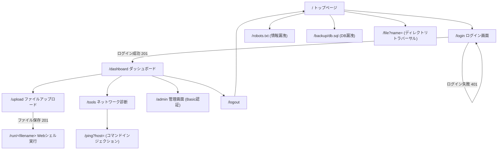
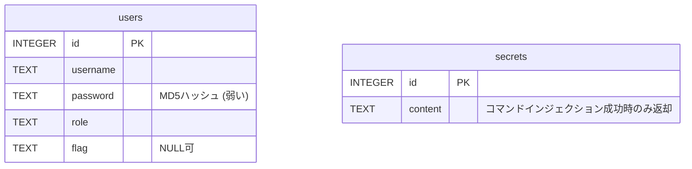

# HackLab — ローカル完結型ペネトレーションテスト練習環境

> **警告**: このアプリは教育目的の「やられアプリ」です。
> 実在するシステムへの攻撃には絶対に使用しないでください。
> 全ての通信はローカルの Docker ネットワーク内に完結します。

---

## 必要環境

| ツール | バージョン |
|--------|-----------|
| Docker Desktop | 4.x 以上 |

---

## ショートカットコマンド (Makefile)

`hacklab/` ディレクトリで `make <コマンド>` を実行します。

| コマンド | 動作 |
|---------|------|
| `make up` | 初回起動（イメージビルド込み） |
| `make start` | 2回目以降の起動（バックグラウンド） |
| `make stop` | 停止（コンテナを残す） |
| `make down` | 停止 + コンテナ削除 |
| `make reset` | 完全リセット（ボリューム・イメージも削除して再ビルド） |
| `make ps` | コンテナの状態確認 |
| `make logs` | 全サービスのログをリアルタイム表示 |

---

## Docker の起動・停止

### 初回起動 (イメージビルド込み)

```bash
cd hacklab
docker compose up --build
```

初回は Docker イメージのビルドに **5〜10 分** かかります。

### 2 回目以降の起動

```bash
docker compose up
```

### バックグラウンドで起動する場合

```bash
docker compose up -d
```

### 停止 (コンテナを残す)

```bash
docker compose stop
```

### 停止 + コンテナ削除

```bash
docker compose down
```

### 完全リセット (ボリューム・イメージも削除して再ビルド)

```bash
docker compose down -v
docker compose up --build
```

### コンテナの状態確認

```bash
docker compose ps
```

### ログの確認

```bash
# 全サービスのログ
docker compose logs

# 特定サービスのログ (リアルタイム)
docker compose logs -f target-web
docker compose logs -f target-ftp
docker compose logs -f target-ssh
```

---

## ネットワーク構成

```
あなたのブラウザ / ターミナル (ホスト OS)
        │
        │  localhost:8081  → target-web (HTTP)
        │  172.20.0.20:21  → target-ftp (FTP)
        │  172.20.0.30:22  → target-ssh (SSH)
        │
┌───────────────────────────────────────┐
│      hacklab-net (172.20.0.0/24)      │
│                                       │
│  target-web  172.20.0.10  :80  HTTP   │
│  target-ftp  172.20.0.20  :21  FTP    │
│  target-ssh  172.20.0.30  :22  SSH    │
└───────────────────────────────────────┘
※ 外部インターネットへの通信は発生しません
```

### ホスト OS からのアクセス

| サービス | URL / 接続先 |
|---------|-------------|
| Web アプリ | http://localhost:8081 |
| FTP サーバー | `ftp 172.20.0.20` (Docker ネットワーク内から) |
| SSH サーバー | `ssh developer@172.20.0.30` (Docker ネットワーク内から) |

> **補足**: `localhost:8081` と `172.20.0.10:80` は同じサーバーへのアクセスです。
> Docker がポートフォワードしているため、ホスト OS からは `localhost:8081` でアクセスできます。
> Burp Suite など **ホスト OS で動くツール**は `localhost:8081` を、
> nmap / ftp / ssh など **コンテナ内で動かすツール**は `172.20.0.10` を使います。

FTP / SSH はホスト OS からポートフォワードしていないため、`docker exec` や同一 Docker ネットワーク内から接続してください。

```bash
# 例: target-web コンテナのシェルから SSH 接続
docker exec -it hacklab-web sh
ssh developer@172.20.0.30
```

---

## 使えるツールと攻撃例

| ツール | 用途 | コマンド例 |
|--------|------|-----------|
| **nmap** | ポートスキャン | `nmap -sV 172.20.0.0/24` |
| **Burp Suite** | HTTP 傍受・改ざん (SQLi / RCE) | ブラウザのプロキシを `127.0.0.1:8080` に設定して `http://localhost:8081` を開く |
| **sqlmap** | SQL インジェクション自動化 | `sqlmap -u "http://localhost:8081/login" --data="username=admin&password=pass" --dbs` |
| **curl** | robots.txt・FTP 匿名ログイン確認 | `curl http://localhost:8081/robots.txt` |
| **Hydra** | SSH ブルートフォース | `hydra -l developer -P wordlist.txt ssh://172.20.0.30` |
| **ftp** | FTP 匿名ログイン | `ftp 172.20.0.20` → ユーザー名 `anonymous` |

> nmap・Hydra・ftp など Docker ネットワーク内のホストへ接続するツールは、
> `docker exec -it hacklab-web sh` でコンテナ内に入ってから実行してください。

---

## 外部 IP を誤って攻撃しないために

攻撃ツールを使う際は **必ずターゲット IP を明示**し、ホスト OS や外部インターネットを対象にしないよう注意してください。

**安全な使い方:**

```bash
# ターゲット IP を明示する (172.20.0.0/24 の範囲のみ)
nmap -sV 172.20.0.10
sqlmap -u "http://172.20.0.10/login" ...
hydra -l developer -P wordlist.txt ssh://172.20.0.30
```

**やってはいけないこと:**

```bash
# NG: ホスト OS や外部ドメインを対象にする
nmap 192.168.x.x       # 自分のホームネットワーク → 絶対 NG
sqlmap -u "https://example.com/..."  # 外部サイト → 不正アクセス
```

**Docker ネットワーク内に閉じ込めて使う (推奨):**

```bash
# target-web コンテナ内から攻撃ツールを実行すれば
# 通信が hacklab-net 内に完全に閉じる
docker exec -it hacklab-web sh
# → ここから nmap / curl / ftp / ssh を実行する
```

---

## 画面遷移図



---

## ER 図



`users` と `secrets` の間に外部キー関係はなく、独立したテーブル。
`secrets` は `/ping` でコマンドインジェクションが検知された場合にのみ
アプリケーションロジック側で参照される (`app.py` の `ping()`)。

---

## 画面モック (ワイヤーフレーム)

### ログイン画面 (`/login`)

```
┌─────────────────────────────────────┐
│              🔐                      │
│           社員ポータル                │
│     TechNova Solutions 従業員専用     │
│                                       │
│  ユーザー名  [__________________]    │
│  パスワード  [__________________]    │
│                                       │
│           [    ログイン    ]         │
│                                       │
│   パスワードを忘れた方は IT サポート  │
│   デスクまでご連絡ください            │
└─────────────────────────────────────┘
```

### ダッシュボード画面 (`/dashboard`)

```
┌─────────────────────────────────────────────┐
│ ようこそ、{{username}} さん                   │
│ TechNova Solutions 社員ポータル | 権限:{{role}}│
├─────────────────────────────────────────────┤
│ クイックアクセス                              │
│ ┌───────────┐ ┌───────────┐ ┌───────────┐  │
│ │📁 ドキュメント│ │🔧 インフラ  │ │⚙️ 管理     │  │
│ │ファイル共有  │ │ネットワーク │ │管理者パネル │  │
│ │ /upload     │ │診断 /tools │ │(要権限)/admin│ │
│ └───────────┘ └───────────┘ └───────────┘  │
├─────────────────────────────────────────────┤
│ お知らせ                                      │
│  ・年末年始の営業時間について                 │
│  ・VPN クライアントのバージョンアップ          │
│  ・フィッシングメールに関する注意喚起          │
└─────────────────────────────────────────────┘
```

---

## チャレンジ概要 (全 7 フラグ)

| Stage | タイトル | 技術 | フラグ |
|-------|---------|------|--------|
| 1 | ネットワーク偵察 | ポートスキャン | `FLAG{recon_network_master}` |
| 2 | Web 探索 | robots.txt / 情報漏洩 | `FLAG{web_recon_complete}` |
| 3 | FTP 匿名ログイン | FTP anonymous | `FLAG{ftp_anonymous_pwned}` |
| 4 | SQL インジェクション | SQLi | `FLAG{sql_injection_champion}` |
| 5a | コマンドインジェクション | OS Command Injection | `FLAG{command_injection_rce}` |
| 5b | Web シェル | File Upload RCE | `FLAG{webshell_deployed}` |
| 6 | SSH 侵入 | 弱い認証情報 | `FLAG{ssh_foothold_established}` |
| ボーナス | 権限昇格 | Privilege Escalation | `FLAG{privilege_escalation_bonus}` |

---

## 攻略の流れ

```
偵察フェーズ                 情報収集フェーズ             侵入フェーズ
─────────────────────────────────────────────────────────────────────
localhost:8081 を開く    →   robots.txt / FTP 探索   →   SQLi / RCE / SSH
                                    │
                              notes.txt 取得
                           (ROT13 エンコード済み)
                                    │
                              SSH 認証情報を解読 → フラグ取得
```

---

## 含まれる脆弱性 (学習リファレンス)

| 脆弱性 | OWASP カテゴリ | 場所 |
|--------|--------------|------|
| SQL インジェクション | A03:2021 Injection | `target-web /login` |
| OS コマンドインジェクション | A03:2021 Injection | `target-web /ping` |
| 任意ファイルアップロード + 実行 | A04:2021 Insecure Design | `target-web /upload`, `/run/<name>` |
| ディレクトリトラバーサル | A01:2021 Broken Access Control | `target-web /file` |
| 機密情報の漏洩 | A02:2021 Cryptographic Failures | `/backup/db.sql`, `/robots.txt` |
| デフォルト / 弱い認証情報 | A07:2021 Auth Failures | SSH `developer:dev2024!`, 管理画面 `admin:hackme123` |
| 弱いハッシュ (MD5) | A02:2021 Cryptographic Failures | users テーブル password カラム |
| ハードコードされた SECRET_KEY | A02:2021 Cryptographic Failures | Flask `app.secret_key` |

---

## よくある質問

**Q: Web アプリに接続できない**
A: `docker compose ps` でコンテナが `Up` 状態か確認してください。
   起動中の場合は少し待ってからリロードしてください。

**Q: SSH / FTP に接続できない**
A: ホスト OS から直接は繋がりません。`docker exec -it hacklab-web sh` で
   target-web コンテナに入り、そこから接続してください。

**Q: FTP の notes.txt が読めない**
A: 匿名ログインで接続できます。`ftp 172.20.0.20` → ユーザー名 `anonymous`、
   パスワードは空 (Enter) で入れます。

**Q: ROT13 のデコード方法は?**
A: Python で `import codecs; codecs.decode('文字列', 'rot13')` を実行します。

**Q: 全フラグ取得後にリセットしたい**
A: `docker compose down -v && docker compose up --build` で完全リセットできます。

---

*HackLab は教育目的のみに使用してください。*
